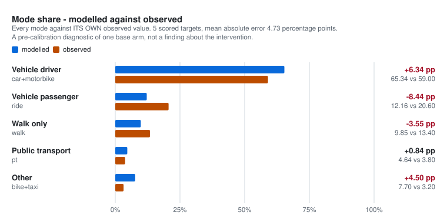
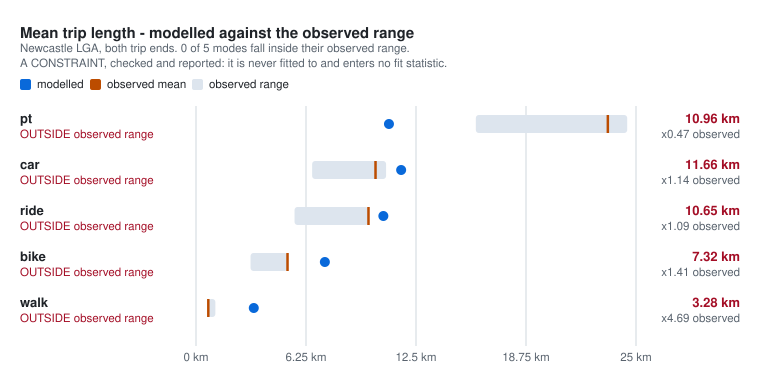
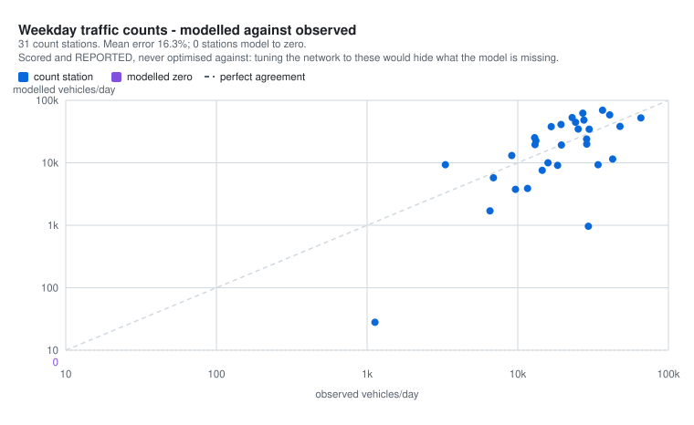

# city-digital-twin

A city-agnostic **digital twin of how a real city moves** — MATSim end to end.
Twelve modes, each physically simulated on the real roads and timetables and
scored against its real-life ridership, driven by a synthetic population drawn
from the published census, survey and licence data. The first city is
**Newcastle (NSW)**; the goal, its hard requirements and the loop every session
runs are in [`GOAL.md`](cities/newcastle/docs/GOAL.md).

Why: once the twin reproduces every mode at its real share, it can be pointed at
questions observation cannot settle — Australia's low light rail usage (Newcastle's
2019 line is the first application, the frozen origin design at
[`design/newcastle-lr-proposal.md`](cities/newcastle/docs/archived/design/newcastle-lr-proposal.md)),
the modes that could relieve a corridor's congestion, the demands of an event the
size of Brisbane 2032. It holds itself to one standard throughout: **every value
that was not observed is derived where it can be, and otherwise declared, given a
sweep range and recorded with the reason it was chosen.**

> **Where it stands:** the [board](cities/newcastle/docs/STATUS.md) carries the
> twelve-mode scoreboard from the latest reading and what is next. Nothing is a
> result until a run's `_run.json` says `ran_to_last_iteration`; the fit figures
> [below](#does-it-reproduce-the-city-not-yet) are the last completed base arm.

---

## What it models

Every person-transport mode is **physically simulated or explicitly priced** — none
is a share assumed at the outset — and every corridor mechanism that a light rail
imposes on the street is represented rather than netted out.

| Modes | How |
|---|---|
| Car, motorbike | Physical on the road network, with parking charged on arrival |
| Vehicle passenger (`ride`) | A passenger **physically in a driver's car**, paired to a real household or escort trip; unpaired demand re-modes rather than teleporting |
| Freight (`truck`) | Physical, at declared PCE, seeded from each cordon station's own observed heavy-vehicle share |
| Bus, heavy rail, light rail, ferry | Scheduled transit on the mapped GTFS, **scored as distinct submodes** so a bus and a tram are not interchangeable in route choice |
| Bike, walk | Physical on the active network, with gradient and directional walk-speed factors |
| Taxi / rideshare | **Physical on the road with a finite fleet** — a request the fleet cannot serve is refused; priced on the published 2025 fares; scored against a target derived from the IPART trips-per-day band |

| Corridor mechanisms | How |
|---|---|
| Traffic signals | **SCATS, implemented as its published algorithm** at the 14 corridor intersections on MATSim's signals contrib: degree of saturation measured at every stop line, cycle and splits adapted toward a target DS, clearances preserved. The operated phase plans and the offset library are the parts TfNSW does not release, so offsets are not adapted (see [below](#what-is-derived-rather-than-observed)) |
| Transit priority | Green extension with a declared priority budget and repayment, keyed to the **tram** in the light-rail scenarios and to the **bus** in the bus-priority counterfactual |
| Level crossings | Freight-train closures at two named crossings, as time-varying link capacity |
| Light rail charging dwell | Native, concurrent with boarding — the wire-free design's cost in run time |
| Lane, kerbside and turn changes | Per scenario, patched onto the network by OSM way id |

Ten scenarios (S0–S6, including three S2 variants) × three day types give the **30
assembled run-input sets**. The light rail's road-space externality is present in
the same run as the tram: a model that simulated the tram without the lane loss
would report a gain that the street never saw.

---

## Set it up

```bash
pip install requests pandas numpy shapely pyproj lxml geopandas pyogrio rasterio openpyxl
python src/setup/bootstrap_toolchain.py             # JDK 25, pt2matsim 26.6, Maven -> .tools/
python src/setup/bootstrap_toolchain.py --run-stack # + the MATSim signals run stack
python tests/check_manifest.py                      # the committed subset is intact
```

Python 3.11+. The toolchain is ~1.4 GiB, gitignored, and **pinned by sha256** —
`--verify` re-checks the digests and compiles the Java without downloading. Signal
runs need the `--run-stack` half: the signals contrib is not in the shaded jar and
must never share a classpath with it. **A toolchain change is a model change.**

## Run a scenario

```bash
python run.py --list        # what is runnable: scenarios, day types, run overlays
python run.py --dry-run     # resolve every input, print it, execute nothing
python run.py --run-config smoke   # a plumbing test: 1% sample, 2 iterations
python run.py --detach --run-config <overlay>   # an arm: S2, weekday, the overlay's sample and horizon
```

**An arm is a multi-hour run** — about 45–50 hours at 25 % × 300 iterations
([`positions/runs-and-economics.md`](cities/newcastle/docs/positions/runs-and-economics.md)
carries the measured seconds-per-iteration for each stack). Four rules stand
before any launch, and the launcher enforces the third:

1. **A stated-cost approval from the user**, spent on use — no arm without one.
2. **25 % sample only** (user directive, 1 September 2026); the run overlay
   declares the horizon, and GOAL.md asks for convergence within 250 iterations.
3. **No open GitHub issue without the `awaiting-run` label**
   (`python src/run/issue_gate.py`; GOAL.md requirement 10).
4. **One arm at a time**, launched with `--detach`, stopped with `--stop`,
   never by hand. `--detach` and `--stop` use the Windows Task Scheduler and
   `taskkill`; on Linux the JVM launches in the foreground and `--stop` kills
   the JVM pid the status card records (#128).

```bash
python run.py --run-config ride_fix_10pct
python run.py --scenario S3 --day SAT --fraction 0.10 --iterations 1000
```

**The runner names the run directory** —
`results/raw/<launch yyyymmddThhmmss>_<iterations>it_<sample pct>pct` — so every run
is dated, sortable and self-describing. Re-invoking with the same parameters resumes
the completed run (identity is the parameter set in `_run.json`, not the name);
`--force` starts a fresh directory and overwrites nothing.

**`results/` manages itself** (DECISIONS.md §9.137): `results/raw/` holds run bulk
as a budgeted cache (`RUN.storage.raw_cap_gb`, oldest runs deleted automatically
once their findings are extracted); `results/processed/` keeps every run's records
and mode-reading snapshots permanently. The runner gates its own run every
`RUN.gate.interval_iterations` iterations and stops it when a mode breaches the
stop bar. Do not rename, delete or edit anything under `results/` by hand — stop a
run with `python run.py --stop <name> --cause "..."`.

| Flag | What it does |
|---|---|
| `--scenario` | `S0`–`S6` and the S2 variants (default `S2`). `--list` shows which have assembled inputs |
| `--day` | `WEEKDAY`, `SAT` or `SUN` |
| `--run-config TAG` | a committed run overlay — **the reproducible way to vary a run** |
| `--fraction` `--iterations` `--threads` `--xmx` `--seed` | registry overrides, checked against each field's declared sweep |
| `--set KEY=VALUE` | a raw MATSim config override, e.g. `ride.constant=-3.4` |
| `--detach` | launch past `PersonPrepareForSim` and return; the run outlives the shell |
| `--stop NAME --cause TEXT` | stop a running arm through the harness and record why — the one sanctioned way |
| `--dry-run` `--list` `--no-metrics` `--force` | resolve-only, list, skip metric extraction, ignore an existing run record |

**`run.py` does not invent an iteration count in code.**
`RUN.controler.last_iteration` is declared in the registry, so a bare `python run.py`
falls back to the committed `default_25pct` overlay — a named sweep member with its
provenance in the overlay file, not a number in a script.

After a run:

```bash
python src/analyse/extract_metrics.py --run <name>           # a bare name resolves via results/raw
python src/calibrate/fit.py           --run <name>           # calibration half only
python src/analyse/run_view.py        --run <name>           # live + replay, congestion map
python src/analyse/build_run_index.py                        # results/INDEX.md
python src/run/prune_run.py           <name>                 # reclaim per-iteration output
```

A run is a result only if its `_run.json` says `ran_to_last_iteration`, and a
run under 250 iterations is a plumbing probe, never evidence. A run that was
stopped — by the gate watcher under the goal's loop, or by `--stop` — is closed
out with a record of its own saying `stopped_at_gate` or `stopped_by_operator`:
its reading is real at that record's `reached_iteration` and says nothing about
any iteration after it. A run that CRASHED gets no record at all; its
`_meta.json` states the cause.

---

## Does it reproduce the city? Not yet

The figures below are drawn by
[`src/analyse/build_fit_figures.py`](src/analyse/build_fit_figures.py) from the run
the calibrated base was written from — `20260821T175907_1000it_25pct`, S2 × WEEKDAY,
25% sample, 1,000 iterations, comparability family `F4-walk-wedge`. They are a
**pre-calibration diagnostic of the base arm**, they predate the ride and walk
repairs now in the model, and they compare no scenario against any other.

**Mode share** — the only block that carries the fit statistic. Of 67 calibration
targets, **35 are scored** and 32 could not be, each with a stated reason; mean
absolute error over the five scored mode shares is **10.65 percentage points**.

<picture>
  <source media="(prefers-color-scheme: dark)" srcset="cities/newcastle/docs/reference/figures/fit_mode_share.dark.svg">
  
</picture>

The errors come in two near-mirror pairs, which is what makes them structural
rather than a matter of tuning: passengers become drivers (−20.51 against
+14.19), and walking trips become cycling trips (−6.12 against +8.01). Both
pairs have since been repaired in the inputs — round-trip passenger bindings and
an observed short-trip distance distribution — and **neither repair has been
measured**. That is what the next arm is for.

**Trip length** — a constraint, checked and reported, never fitted to. **1 of 5**
modes falls inside its observed range.

<picture>
  <source media="(prefers-color-scheme: dark)" srcset="cities/newcastle/docs/reference/figures/fit_trip_length.dark.svg">
  
</picture>

**Traffic counts** — scored and reported, deliberately **not** optimised against:
tuning the network to these would compensate for whatever the model is still
missing rather than diagnose it. Across **30** count stations the mean error is
**-91.8%**, and **6** stations model to zero. The residual is unexplained — the
explanation the record used to give was retired when the boundary through-traffic
tier was built and measured as making no difference — and it is tracked as
[issue #82](https://github.com/praneetdhoolia/city-digital-twin/issues/82).

<picture>
  <source media="(prefers-color-scheme: dark)" srcset="cities/newcastle/docs/reference/figures/fit_counts.dark.svg">
  
</picture>

**On light rail patronage.** The arm puts the light rail at **1,260** weekday
boardings. The nearest published observation — 3,417 boardings/day — is the
March 2019 to February 2020 market, and `fit.py` **refuses to score it**: PT mode
share roughly halved between that vintage and the 2024/25 base the model calibrates
to, so the difference between the two numbers is not an error statistic. It is
recorded as unscored, with the reason, in
[`FIGURES.json`](cities/newcastle/docs/reference/figures/FIGURES.json).

Full rows, every unscorable target and the parameter provenance:
[`CALIBRATION_REPORT.md`](cities/newcastle/docs/reference/CALIBRATION_REPORT.md).
Regenerate the figures and the report together after a new arm:

```bash
python src/analyse/build_fit_figures.py          # --check verifies they are current
python src/calibrate/report.py --run <run dir>
```

---

## Five words

- **Arm** — one scenario run, launched detached, gated every 100 iterations; not a result until its `_run.json` says `ran_to_last_iteration`.
- **Family** — a comparability class: every run since a change to the plans or the network; nothing compares across families (`cities/newcastle/docs/run_families.json`).
- **Gate** — the reading of all twelve modes against their targets every 100 iterations; a mode at or past 20 % stops the run.
- **Holdout** — the 143 of 210 validation targets that stay unread until the end; the 67 others are the calibration half.
- **`awaiting-run`** — the label an open issue must carry before any launch: the only thing left to do on it is a measurement that needs the run.

## What is here

| | |
|---|---|
| Files in the manifest | **512** ([`data/MANIFEST.csv`](cities/newcastle/data/MANIFEST.csv): hash, rows, producing script, source, licence, retrieval date) |
| Package on disk | 4.07 GiB across `data/`, `networks/`, `schedules/`, `demand/`, `scenarios/` (the manifest's total) — mostly gitignored and regenerable |
| Study area | Newcastle, Lake Macquarie, Maitland, Cessnock, Port Stephens — 4,086 km² |
| Zones | 1,500 core SA1 + 201 external SA1, 222 core DZN |
| Population | 611,915 (2021 Census) → 612,634 synthetic agents |
| Road network | 50,182 edges, 11,434 km, gradient-attached |
| Active network | 40,195 edges, 7,920 km, directional walk-speed factors |
| PT | 5 GTFS eras + 10 scenario variants, 15 feeds mapped, 0 unmapped stops |
| Input registry | 464 controllable fields, each with units, provenance and a sweep or a held-fixed rule, and each sweep saying what it is for |
| Validation | 210 targets, pre-registered 67 calibration / 143 holdout |
| Base year | 2026 · CRS EPSG:28356 (GDA94 / MGA Zone 56) |

Every derived file above is regenerable from the immutable raw downloads by a
committed script, and every one is listed in the manifest with its hash, row count,
producing script, source, licence and retrieval date. Three checks stand behind that
claim: `tests/check_manifest.py` verifies the committed subset in CI,
`tests/check_package.py` verifies the full package locally where the bulk data
actually is, and `tests/check_doc_currency.py` verifies that the numbers written into
this page still equal the artefacts they describe.

---

## Documentation

| | |
|---|---|
| [`cities/newcastle/docs/GOAL.md`](cities/newcastle/docs/GOAL.md) | **What the twin is for** — the hard requirements, the gate loop, the monitoring rule. Read first |
| [`cities/newcastle/docs/STATUS.md`](cities/newcastle/docs/STATUS.md) | **The board, one page** — the twelve-mode scoreboard, phase state, runs, next action |
| [`cities/newcastle/docs/positions/`](cities/newcastle/docs/positions) | **The current truth per topic** — ride, signals, sampling, seed, taxi, walk and bike, PT yardsticks, and more; one page each, every figure sourced |
| [`cities/newcastle/docs/DECISIONS.md`](cities/newcastle/docs/DECISIONS.md) | **The record**: every value that is not observed and every decision, with rationale and sweep. Enter through its index or a position page |
| [`cities/newcastle/docs/archived/design/newcastle-lr-proposal.md`](cities/newcastle/docs/archived/design/newcastle-lr-proposal.md) | The frozen origin design: the light-rail counterfactual, now the twin's first application |
| [`docs/README.md`](docs/README.md) | The **framework's** documentation index; the portable input contract itself is [`config/schema/`](config/schema) |
| [`.claude/CLAUDE.md`](.claude/CLAUDE.md) | Conventions and hard constraints for anyone — human or agent — changing this repo |

**A value in this model is observed, derived or declared-with-a-sweep, and the
record says which.** Read the position page for a topic before changing anything
in it.

---

## Layout

**The framework is city-agnostic; everything Newcastle-specific lives under
`cities/newcastle/`.** That split is the point: `config/schema/` states what *any*
city must supply, and a city directory is one instance of it.

```
run.py                       run a scenario
config/schema/               PORTABLE: what any city must supply, and in what shape
src/city.py                  resolves which city's inputs a run reads
src/build/                   layer construction (the reproduction pipeline)
src/run/                     the run harness
src/calibrate/               fit and calibration
src/analyse/                 metrics, figures, run view, replay
src/registry/                the registry resolver, validators and docs generator
src/java/citysim/            MATSim entry point: parking, fares, ride pairing, telemetry
src/java_signals/citysim/    the signals entry point and its tram/bus priority controller
tests/                       check_manifest.py, check_doc_currency.py,
                             check_city_agnostic.py (CI); check_package.py (local)
results/                     run outputs (gitignored): raw/ the budgeted bulk cache, processed/ the permanent findings

cities/newcastle/            ONE CITY - every Newcastle/NSW/Australia-specific input
  registry/                  the 464 declared values, with units, provenance, sweeps
  overlays/scenarios|day|runs  per-scenario, per-day-type and per-run value overlays
  extract/                   acquisition adapters: ABS, TfNSW Open Data, Overpass
  build/                     builders that encode THIS city's intervention,
                             corridor, history and statistical geography
  docs/                      THIS city's study: STATUS, DECISIONS, design,
                             audit, handover and the generated reference
  geometry/                  declared extents that were once typed into scripts
  data/raw/                  immutable downloads + provenance_*.json
  data/processed/            zones, census, hts, observed, network, corridor, landuse
  data/MANIFEST.csv          every file: hash, rows, producing script, source, licence
  networks/                  OSM extracts, the MATSim network and variants
  schedules/                 GTFS era feeds + scenarios/S0..S6 variants
  demand/                    synthetic population (B1) and plans (B2 tours, MATSim plans)
  params/                    C1 behavioural parameters + the sensitivity sweep grid
  scenarios/                 E1 scenario configs + matsim/ assembled run inputs
```

Paths inside a city are recorded city-relative — `data/processed/network/...`, not
`cities/newcastle/data/processed/network/...` — so the same manifest row means the
same thing in every city. `src/city.py` is the only module that knows where a city
lives; the city is selected by `CITYSIM_CITY` (default `newcastle`).

---

## Reproducing the data package

Every derived file is regenerable by a committed script from the immutable raw
downloads, seeded (`20260810`) and deterministic — with one measured exception:
**pt2matsim's schedule mapping is not reproducible run to run**. About 18% of transit
route link sequences differ between identical builds while 100% of stop-to-link
assignments hold, so **any scenario comparison must use a single build of the network**
([`DECISIONS.md`](cities/newcastle/docs/DECISIONS.md) §3.5).

```bash
# --- acquisition (network-bound, ~2 GiB) ---
python cities/newcastle/extract/overpass.py                  # OSM, 10 themed extracts over 8 tiles
python cities/newcastle/extract/fetch_gtfs.py                # era GTFS from the TfNSW S3 archive
python cities/newcastle/extract/fetch_open_data.py           # Opal, traffic counts, HTS
python cities/newcastle/extract/fetch_abs_dem.py             # ABS boundaries, census, DEM

# --- clipping ---
python cities/newcastle/extract/extract_zones.py
python cities/newcastle/extract/extract_census.py
python cities/newcastle/extract/extract_hts.py
python cities/newcastle/extract/slice_newcastle.py

# --- layer construction ---
python cities/newcastle/build/build_era_feeds.py             # A3 era variants
python src/build/build_network_layers.py        # A1, A2, A5, A6
python src/build/attach_gradient.py             # gradient onto A1 and A6
python src/build/attach_speed_zones.py          # TfNSW regulated speed zones
python cities/newcastle/build/build_corridor_layers.py       # A4 + corridor A2
python cities/newcastle/build/build_landuse_parking.py   # D1 + A5 completion
python src/build/build_zone_attractions.py      # jobs to SA1, attraction terms
python src/build/build_params.py                # C1
python src/build/build_population.py            # B1 persons + households (~30 s)
python src/build/build_gtfs_extras.py           # A3 extras
python cities/newcastle/build/build_scenario_schedules.py    # S0..S6 feeds
python cities/newcastle/build/build_era1_reconstruction.py   # pre-2014 reconstruction
python cities/newcastle/build/build_scenario_configs.py      # E1
python cities/newcastle/build/build_validation_targets.py

# --- P2 network build (needs the toolchain) ---
python cities/newcastle/build/build_corridor_road_attributes.py
python src/build/build_matsim_network.py        # MATSim network + 15 mapped schedules
python cities/newcastle/build/build_matsim_signals.py    # explicit corridor signal data
python cities/newcastle/build/build_level_crossings.py   # level-crossing closure events

# --- P3 demand synthesis (needs the P2 build above) ---
python src/build/measure_network_factors.py     # C2: detour factor, day-type split
python src/build/build_activity_chains.py       # B2 tours, 3 day types (~90 s, 790 MB)
python src/build/build_matsim_plans.py          # MATSim population per day type
python src/build/build_matsim_run_inputs.py     # 30 runnable scenario x day-type sets

python src/build/build_data_dictionary.py
python src/build/build_manifest.py              # regenerate the manifest LAST
```

---

## Sources and licensing

| Source | Licence |
|---|---|
| TfNSW Open Data Hub — GTFS, Opal, traffic counts, HTS, speed zones | CC-BY 4.0 |
| ABS — Census DataPacks, ASGS boundaries | CC-BY 4.0 |
| OpenStreetMap (via Overpass) | **ODbL 1.0 (share-alike)** |
| Copernicus GLO-30 DEM | ESA, free and open |

OSM-derived layers are **ODbL**, which is share-alike; derived network files inherit
that obligation and the rest of the package is CC-BY 4.0. Keep the distinction visible
in anything published. Per-file provenance is in
[`data/MANIFEST.csv`](cities/newcastle/data/MANIFEST.csv).

---

## What is derived rather than observed

The rule ([`GOAL.md`](cities/newcastle/docs/GOAL.md) requirement 6): a disclosed
value is used exactly; an undisclosed one is researched and derived; a sweep is the
fallback only where derivation is genuinely impossible, and then the reason is
stated and the value is never pinned.

- **SCATS signal operation** — TfNSW does not release the operated phase plans or
  the offset library. The published SCATS algorithm is **implemented** instead
  (degree of saturation, cycle and split adaptation, priority); offsets are not
  adapted because no algorithm replaces the unreleased library. See
  [`positions/signals-and-crossings.md`](cities/newcastle/docs/positions/signals-and-crossings.md).
- **Rail and tram patronage** — held to the **disclosed** weekday boardings
  (station entries; the line's own Opal series). **Ferry** patronage is not
  published anywhere, so its target is derived from the harbour's market.
- **Licence holding** — the published TfNSW licence count over the ABS population,
  per age band and LGA.
- **Journey-linked Opal** — not published; the transfer penalty it would estimate
  is swept 3–15 minutes. **Measured charging dwell** — no published figure; swept.

Also absent: pedestrian counts, frontage-level retail floorspace and vacancy,
parking meter transactions, and a 2014 timetable to validate the era-1
reconstruction. The current position on every input is
[`positions/network-and-inputs.md`](cities/newcastle/docs/positions/network-and-inputs.md).
